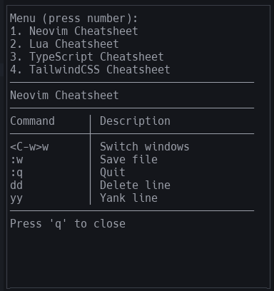

# easyref.nvim

your easy reference of dictionaries a.k.a cheatsheets inside fixed-panel-view cross-projects



## instalation

```lua
require "modules.cheatsheet"
require("modules.cheatsheet").setup()
vim.cmd [[Cheatsheet]]
```

## todos

## enjoy
